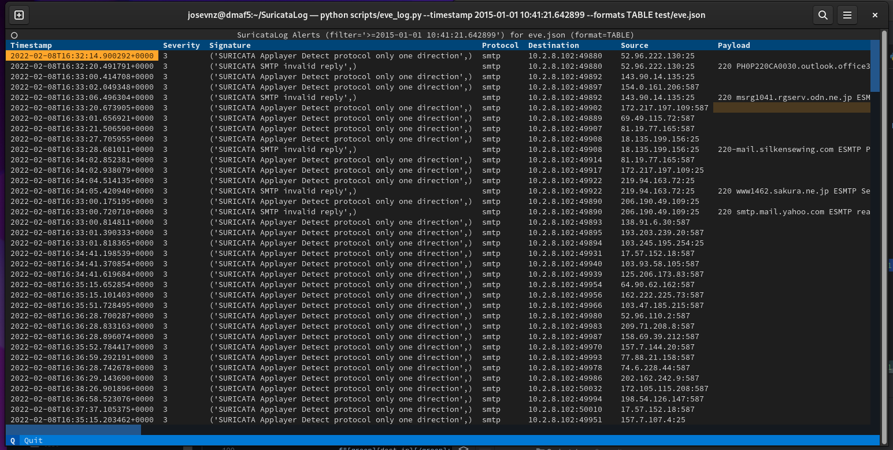
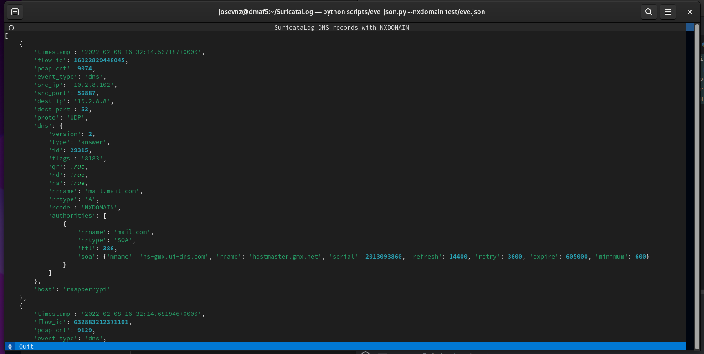
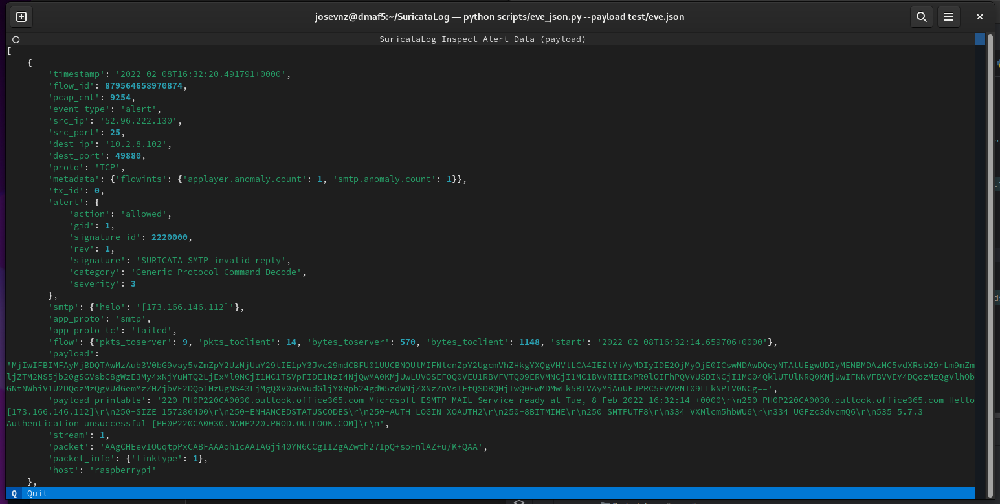
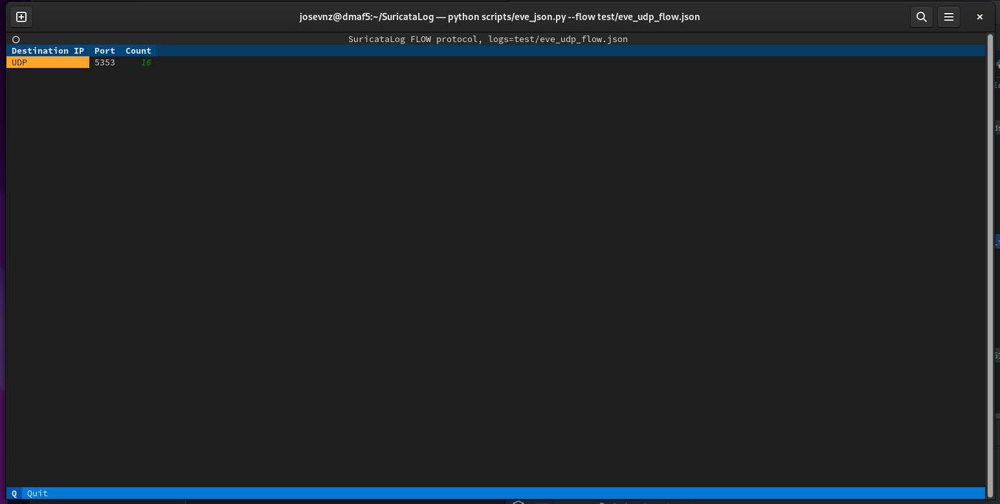
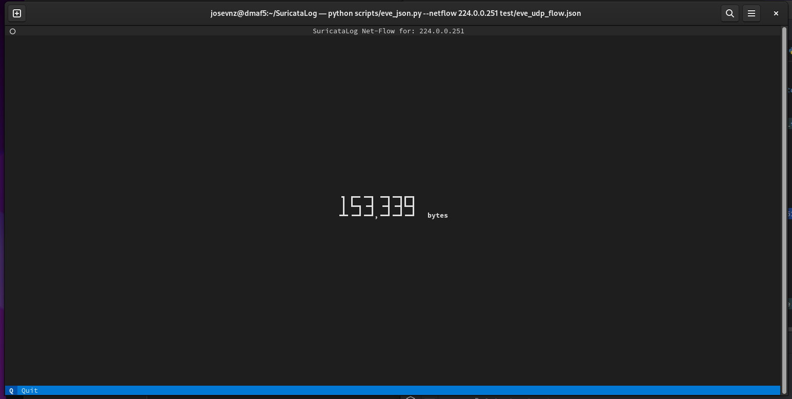
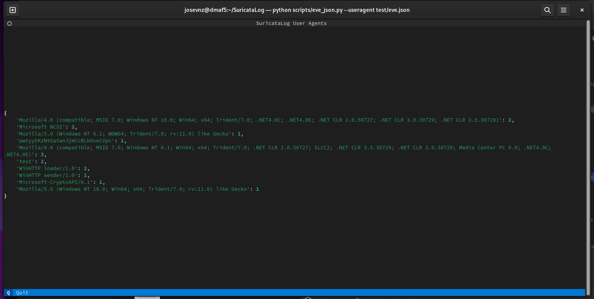
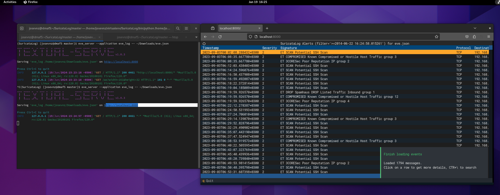

# SuricataLog

[](https://pepy.tech/project/suricatalog)

When I started learning how to use [Suricata](https://suricata.io/) quickly found that I needed a tool to inspect the eve.json file; Most of the tutorials 
and documentation out there suggested installing a stack to do the following tasks:
1. Store the logs in a central location
2. Normalize and enrich the events, specially alerts
3. Use a frontend to dive into the data

Which is very useful, but what if I just needed to do a quick inspection of the events?

Sooner or later you will get [bored to death](https://suricata.readthedocs.io/en/suricata-6.0.0/output/eve/eve-json-examplesjq.html) doing this:

```shell
cat eve.json | jq -r -c 'select(.event_type=="alert")|.payload'| base64 --decode
```

SuricataLog is a set of tools/ scripts to parse and display Suricata log files (like /var/log/suricata/eve.json)

The [Eve JSON format](https://suricata.readthedocs.io/en/suricata-6.0.0/output/eve/eve-json-format.html) is not very complex, 
so I wrote few scripts with the features I tough would be more useful for my home network analysis.

As a bonus, I wrote my learning experience as a [tutorial](TUTORIAL.md) that you can use to learn about Suricata and also how to test it.

## Installing from PIP

Before you do anything else, make sure your environment is good to go:

```shell
python3 -m venv ~/virtualenv/suricatalog
. ~/virtualenv/suricatalog/bin/activate
python3 -m pip install --upgrade pip setuptools wheel
```

### Installing from Pypi.org

```shell
pip3 install --upgrade SuricataLog
```

### Installing from source

```shell
git clone git@github.com:josevnz/SuricataLog.git
cd SuricataLog
python3 -m venv ~/virtualenv/suricatalog
. ~/virtualenv/suricatalog/bin/activate
python3 -m pip install --upgrade build
python3 -m build
pip3 install dist/SuricataLog-X.Y.Z-py3-none-any.whl
```

### Developer installation

So you want to contribute? Or found a bug and think you can submit a patch? Nice! Here is what you can dd to run on development mode:

```shell
git clone git@github.com:josevnz/SuricataLog.git
cd SuricataLog
python3 -m venv ~/virtualenv/suricatalog
. ~/virtualenv/suricatalog/bin/activate
pip install --upgrade pip
python -m pip install --upgrade build
pip install textual-dev
pip install --editable .
```

Running unit tests is very easy after that:
```shell
(SuricataLog) [josevnz@dmaf5 SuricataLog]$ python -m unittest test/*.py
.........
----------------------------------------------------------------------
Ran 9 tests in 0.334s

OK
```

If the unit tests fails, then this is most likely the first place to fix a problem.

I do recommend also running the textualize console and watch for the console messages:

```shell
textual console
```

Then on another terminal:

```shell
textual run --dev --command eve_log --timestamp '2015-01-01 10:41:21.642899' --formats TABLE test/eve.json
```

### Creating a Docker image

Please check [DOCKER.md](DOCKER.md) for more details.

## Running the scripts

Once everything is installed in  your virtual environment you should be able to call the scripts

### Simple EVE log parser

Better see it by yourself (remember, use --help to learn what options are supported)

#### Table format:



````shell
eve_log --timestamp '2015-01-01 10:41:21.642899' --formats TABLE test/eve.json
````

### Canned reports with eve_json.py

```shell
(suricatalog) [josevnz@dmaf5 SuricataLog]$ eve_json --help
usage: eve_json [-h] [--nxdomain | --payload | --flow | --netflow NETFLOW | --useragent] eve [eve ...]

This script is inspired by the examples provided on [15.1.3. Eve JSON ‘jq’ Examples](https://suricata.readthedocs.io/en/suricata-6.0.0/output/eve/eve-json-
examplesjq.html) A few things: * The output uses colorized JSON

positional arguments:
  eve                Path to one or more /var/log/suricata/eve.json file to parse.

optional arguments:
  -h, --help         show this help message and exit
  --nxdomain         Show DNS records with NXDOMAIN
  --payload          Show alerts with a printable payload
  --flow             Aggregated flow report per protocol and destination port
  --netflow NETFLOW  Get the netflow for a given IP address
  --useragent        Top user agent in HTTP traffic
```

Take a look at some examples below:

#### NXDOMAIN



```shell
eve_json --nxdomain test/eve.json
```

#### PAYLOAD



```shell
eve_json --payload ~/Downloads/eve.json
```

#### FLOW



```shell
eve_json --flow test/eve_udp_flow.json
```

#### NETFLOW



```shell
eve_json --netflow 224.0.0.251 test/eve_udp_flow.json
```

#### USERAGENT



```shell
eve_json --useragent test/eve.json
```

### Running eve_* applications on a browser



You can run Suricata Log applications on a browser by using the `eve_server` wrapper:

```shell
# Show the flow report on a eve.json file
eve_server --application eve_json -- --flow ~/eve.json

# Show NX domain report
eve_server --application eve_json -- --nxdomain ~/eve.json

# Inspect the eve.json records
eve_server --applications eve_log -- ~/eve.json
```

You need to pass the '--' to tell the server than this options belong to the underlying eve_* you want to call.

## Running from Docker

It is also possible to run SuricataLog from a Docker container. Please see the [DOCKER.md](DOCKER.md) for more details

## Supported versions

I work on this project on **my spare time** and I cannot support every version of Linux/ Python combination out there.
This is my current test bed, and it may change without further notice

| SuricataLog | Supported | OS                               | Python    | Suricata |
|-------------|-----------|----------------------------------|-----------|----------|
| <= 0.8      | NO        | NA                               | <  3.8    | 6.04     |
| 0.9+        | NO        | fedora 37                        | => 3.11.4 | 6.04     |
| 0.9+        | NO        | Armbian 23.02.2 Jammy            | => 3.10.6 | 6.04     |
| 0.9+        | NO        | Ubuntu 20.04.4 LTS (Focal Fossa) | => 3.8.10 | 6.04     |
| 1.0.3+      | YES       | fedora 40                        | => 3.11.4 | 7.0.6    |

*You are more than welcome to*:
* Submit patches with new features and bug-fixes.
* Open bug reports. Be as detailed as possible, otherwise I will have no choice but to close it.

## Tutorials
* [Suricata, RaspberryPI4 and Python to secure your home network](TUTORIAL.md)
* [Using SuricataLog to analyze your events](Using_SuricataLog_to_analyze_your_events.md)
